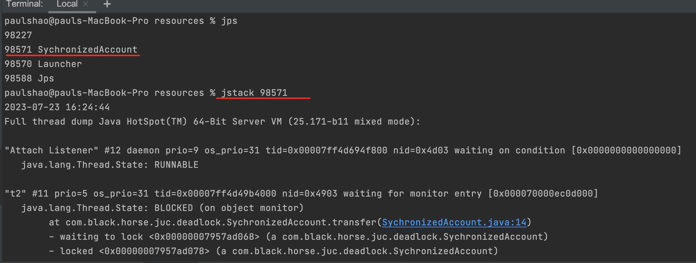
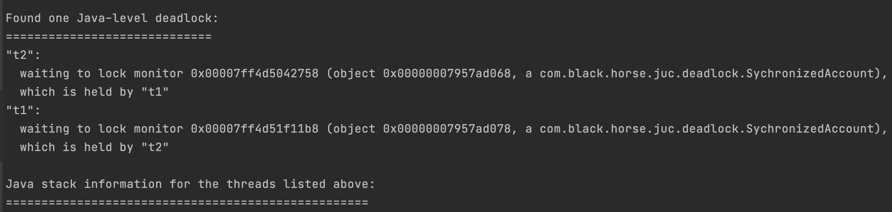
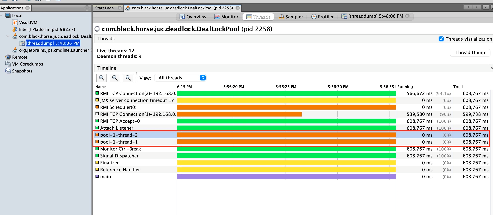

Week4 HomeWork
============
### 1. 请你说说什么是线程和进程？

- **区别**：
  - 进程是内存运行中的一个应用程序，是系统运行的基本单位。每个进程都有自己独立的内存空间。
  - 线程是操作系统中调度执行的基本单位。多线程间堆空间和方法区是共享的，栈空间和程序计数器是独立的。
-------
- **关系**：一个进程可以包含多个线程，线程是进程的一个执行单元
-------
- **线程的上下文切换是什么**：任务调度器会分配时间片给每个线程，在时间片结束时，线程会归还CPU使用权并保存自己的任务信息（程序计数器，栈帧）。
在下一个时间片开始时，下一个线程线程会获得CPU使用权并加载自己的任务信息（程序计数器，栈帧）， 这一过程叫上下文切换。
会发生上下文切换的情况：
  - 线程的时间片用完
  - 垃圾回收
  - 有更高优先级的线程需要运行
  - 线程调用了wait, join, park, lock, sleep等方法
-------
- **线程的并发和并行有什么区别**：
  - 并发是同一时间应对多件事的能力
  - 并行是同一时间做多件事的能力
-----------------

### 2. 使用了多线程会带来什么问题呢？

- **线程安全问题**：线程安全问题出现在**多线程**共享**同一资源**时，对该资源进行了**非原子性的操作**。
<br/>避免线程安全的方法：
  - 无状态方法 <br/>
  ```java
  public class MathUtils {
    
    public static BigInteger factorial(int number) {
        BigInteger f = new BigInteger("1");
        for (int i = 2; i <= number; i++) {
            f = f.multiply(BigInteger.valueOf(i));
        }
        return f;
    }
  }
  ```
  - final类或不可变对象
  ```java
    public final class Person {
        private final String name;
        private final int age;

        public Person(String name, int age) {
            this.name = name;
            this.age = age;
        }

        public String getName() {
            return name;
        }

        public int getAge() {
            return age;
        }
    }
  ```
  - Thread-Local字段
    - 单线程中的私有字段，只有该线程能对它进行操作
    - ThreadLocal
      ```java
        public class ThreadState {
    
            public static final ThreadLocal<StateHolder> statePerThread = new ThreadLocal<StateHolder>() {
    
                @Override
                protected StateHolder initialValue() {
                    return new StateHolder("active");  
                }
            };
    
            public static StateHolder getState() {
                return statePerThread.get();
            }
        }
      ```
  - synchronized 集合/代码块/方法
    - 集合： Collections.synchronizedCollection(),Collections.synchronizedMap()
    - 互斥锁：jdk < 1.6 重量级锁。jdk >= 1.6 (偏向锁-->轻量级锁-->重量级锁) , 通过对Monitor的操作进行实现
  - volatile:通过内存屏障保证可见性和有序性，但并不能保证操作的原子性
  - Atomic类（AtomicInteger/AtomicLong/AtomicBoolean等）：存在ABA问题，使用时需加入版本号。
  - Concurrent包：ConcurrentHashMap, CopyOnWriteArrayList (只能保证数据的最终一致性，操作过程中可能读到旧值) 等
  - Lock
    - Object Lock
    - ReentrantLock： 当对一个资源读特别多写少的时候，可使用读写锁
-------
- **原子性，可见性，有序性**：要保证多线程程序正确运行，需同时保证原子性，可见性和有序性
  - 有序性：Java编译器、运行时和处理器都会保证，在单线程下遵循as-if-serial语义的情况下会进行指令重拍。
  但在多线程的情况下，指令重拍就会有影响。
  ```java
    public class Singleton {  
        private volatile static Singleton instance;  
        private Singleton (){}  
        public static Singleton getSingleton() {  
            if (instance == null) {  
                synchronized (Singleton.class) {  
                    if (instance == null) {  
                        instance = new Singleton(); // 1.分配内存空间 2.实例化对象instance 3.将instance指向刚分配的内存
                    }  
                }  
            }  
            return instance;  
        }  
    }
  ```
  如果instance不是volatile, 创建对象时可能会进行指令重排 1-->3-->2. 线程A先获取对象，进行至1-->3时被阻塞，
  此时线程B进入getSingleton()方法， instance已不为空，但返回给线程B的是没有实例化好的instance。<br/>
  这里的instance是volatile, 才会遵循JMM的happen-before原则。不会对1-->2-->3 进行指令重排
  - 可见性：在JMM中线程间共享的变量都会存储在主内存中，每个线程都有个本地内存，存储着共享变量的副本。当线程A修改共享变量，其实是修改本地内存中的副本。
  此时线程B读取这个共享变量的值，很可能读不到线程A修改后的值（JMM还未来得及同步主内存和各个线程的本地内存），还是线程B本地内存的旧值。这是就产生了共享变量可见性的问题。<br/>
  JMM提供了两种方法解决可见性问题：
    - volatile: 采用内存屏障 （CPU指令 store/load）
      - 写操作时，通过在写操作指令后加入一条store屏障指令，让本地内存中变量的值能够刷新到主内
        存中
      - 读操作时，通过在读操作前加入一条load屏障指令，及时读取到变量在主内存的值
    - synchronized: 
      - 线程解锁前,必须把自己本地内存中共享变量的最新值刷新到主内存中。
      - 线程加锁时，将清空本地内存中共享变量的值，从而使用共享变量时需要从主内存中重新读取最新的值
  - 原子性：一个操作是不可中断的，要么全部执行要么全部失败。</br>
  JMM定义了8种情况是原子的：
    - lock
    - unlock
    - read
    - load
    - use
    - assign
    - store
    - write
    ```java
        a++; // 过程：load --> use --> assign。 所以a++并非原子性的操作
    ```
    Java 提供了Atomic包、JUC锁、普通锁、synchronized 解决操作的原子性问题。
-----------------

### 3. 什么是死锁？如何排查死锁?

多个线程在竞争资源时形成相互等待的僵局，若无外力干预，线程无法推进，这种情况就是死锁。
当遇到死锁时，可以利用不同的工具进行排查：

- jstack命令：</br>
```java
public class SychronizedAccount {

    private int balance;

    public SychronizedAccount(int balance) {
        this.balance = balance;
    }

    public void transfer(SychronizedAccount target, int amt) {
        synchronized (this) {
            synchronized (target) {
                if (balance > amt) {
                    this.balance -= amt;
                    target.balance += amt;
                }
            }
        }
    }

    public static void main(String[] args) throws InterruptedException {
        final SychronizedAccount a = new SychronizedAccount(100);
        final SychronizedAccount b = new SychronizedAccount(100);

        Thread th1 = new Thread(() ->{
            int count = 0;
            while (count++ < 1000) {
                a.transfer(b, 5);
            }
        }, "t1");

        Thread th2 = new Thread(() ->{
            int count = 0;
            while (count++ < 1000) {
                b.transfer(a, 5);
            }
        }, "t2");

        th1.start();
        th2.start();

        th1.join();
        th2.join();

        System.out.println("end");
    }
}
```
通过jps找到pid, 然后运行 jstack ${pid}  </br>


从打印出的信息中可以看到，t2需要的锁正在被t1占用，而t1需要的锁正在被t2占用

- jvisualvm: jstack可以有效的发现一些简单的死锁，但是现实中有时往往会遇到复杂的情况。比如线程池的死锁很难被jstack发现</br>
```java
public class DealLockPool {

    final private ThreadPoolExecutor threadPool = new ThreadPoolExecutor(2, 2,
            5, TimeUnit.SECONDS, new LinkedBlockingQueue<>(100),
            Executors.defaultThreadFactory(), new ThreadPoolExecutor.AbortPolicy());

    public class SubTask implements Callable<String> {
        private final String taskName;
        public SubTask(String taskName) { this.taskName = taskName; }


        @Override
        public String call() throws Exception {
            System.out.println("process " + taskName);
            return taskName;
        }
    }

    public class StartTask implements Callable<String> {
        private final String taskName;
        public StartTask(String taskName) { this.taskName = taskName; }

        @Override
        public String call() throws Exception {
            int count = 0;
            while (count++ < 3) {
                Future<String> subTask = threadPool.submit(new SubTask(taskName + "-" + count));
                String name = subTask.get();
                System.out.println("complete: " + name);
            }

            return taskName;
        }
    }

    public void submitTask(String taskName) {
        threadPool.submit(new StartTask(taskName));
    }

    public static void main (String[] args) throws InterruptedException {
        DealLockPool dealLockPool = new DealLockPool();
        dealLockPool.submitTask("task1");
        dealLockPool.submitTask("task2");

        Thread.sleep(1000);
        dealLockPool.threadPool.shutdown();

        while (!dealLockPool.threadPool.isTerminated()) {
            Thread.sleep(1000);
        }

        System.out.println("END");
    }


}
```

从图中，可以发现线程池中的两个线程都在wait/park状态。结合代码发现线程都卡在
```java
String name = subTask.get();
```
Main中创建StartTask并放入线程池中，StartTask也将创建的SubTask放在同一个线程池中。
StartTask依赖于SubTask的返回值，而线程池总共只有2个线程，从而导致了这种饥饿式的死锁。